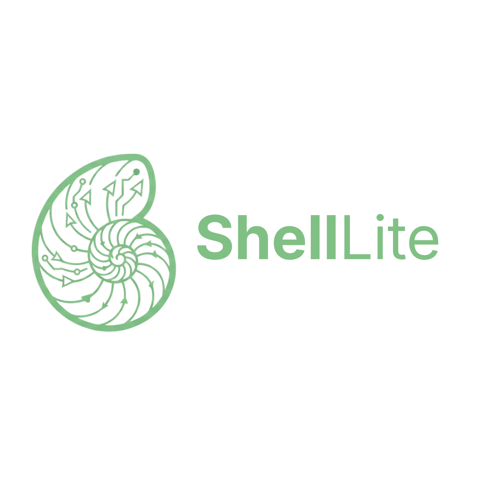

# ShellLite: The English-Like Programming Language
# By Shrey Naithani
ShellLite is a modern, interpreted programming language designed to prioritize human readability. It replaces complex syntax with natural English commands, making software development accessible and maintainable.

## Version 0.05.0 (Performance Update)

This release introduces native compilation via LLVM, transforming ShellLite into a compiled language alongside its interpreted mode:
1. **LLVM Backend**: Compile ShellLite code to native machine code for improved performance.
2. **The Bridge**: Import and use any Python library (pandas, requests, etc.) natively.
3. **The Canvas**: Build native desktop GUI applications with declarative syntax.
4. **The Universe**: Integrated package management for project dependencies.

## Installation

### Via PyPI (Recommended)
You can install ShellLite directly from PyPI:
```bash
pip install shell-lite
```

### Windows Installer
Download the latest `shl.exe` from the Releases page.

## Compilation

To compile ShellLite code to native machine code (LLVM IR):

```bash
shl compile script.shl
```

You can also specify different compilation targets:

```bash
shl compile script.shl --target llvm   # Default: LLVM IR (native)
shl compile script.shl --target js     # JavaScript
shl compile script.shl --target python # Python
```

## Quick Start

### 1. Hello World
Save this as `hello.shl`:
```shell-lite
say "Hello, World"
```
Run it:
```bash
shl hello.shl
```
## Project Management

Initialize a new project:
```bash
shl init
```

Install dependencies defined in `shell-lite.toml`:
```bash
shl install
```

## Ecosystem & Tools

| Tool | Description | Link |
| :--- | :--- | :--- |
| **Book** | teaches cognitive friendly language design, controlled natural languages, compiler construction, forgiving parsing, FFI bridging, performance tuning, and provides full grammar, implementation, and architecture. | [Book](https://books2read.com/b/mVpoXM) |
| **Research Artifact** | Published on Zenodo By CERN | [GitHub](https://github.com/Shrey-N/ShellDesk) |
| **ShellDesk** | The official IDE for ShellLite. | [GitHub](https://github.com/Shrey-N/ShellDesk) |
| **VS Code Extension** | Syntax highlighting and snippets. | [Marketplace](https://marketplace.visualstudio.com/items?itemName=ShellLite.shelllite-hello) / [OpenVSX](https://open-vsx.org/extension/shelllite/shelllite-hello) |
| **Website** | Official website source code. | [GitHub](https://github.com/Shrey-N/ShellLite-Website) |

## Documentation

Full documentation is available in the `docs/` folder:

### Language Guide
- [Getting Started](docs/01_Getting_Started.md)
- [Language Basics](docs/02_Language_Basics.md)
- [Control Flow](docs/03_Control_Flow.md)
- [Data Structures](docs/04_Data_Structures.md)
- [Functions and OOP](docs/05_Functions_and_OOP.md)
- [Modules and Standard Library](docs/06_Modules_and_StdLib.md)
- [System Mastery](docs/07_System_Mastery.md)
- [Web Development](docs/08_Web_Development.md)

### Advanced Topics
- [Advanced Features](docs/09_Advanced_Features.md)
- [Compilation and Performance](docs/10_Compilation_and_Performance.md)
- [Testing and Debugging](docs/11_Testing_and_Debugging.md)
- [API Reference](docs/12_API_Reference.md)

### Guides and Resources
- [Security Guide](docs/13_Security_Guide.md)
- [Migration Guide](docs/14_Migration_Guide.md)
- [Troubleshooting](docs/15_Troubleshooting.md)
- [Examples and Tutorials](docs/16_Examples_and_Tutorials.md)
- [Best Practices](docs/17_Best_Practices.md)

## CLI Commands

| Command | Description |
| :--- | :--- |
| `shl <file.shl>` | Run a ShellLite script |
| `shl` | Start the interactive REPL |
| `shl compile <file>` | Compile to native code (LLVM) |
| `shl compile <file> --target js` | Compile to JavaScript |
| `shl init` | Initialize a new project |
| `shl install` | Install project dependencies |
| `shl get <user/repo>` | Install a package from GitHub |
| `shl fmt <file>` | Format a script |
| `shl check <file>` | Lint a file (JSON output) |
| `shl help` | Show help message |

License: MIT
Made by Shrey Naithani
