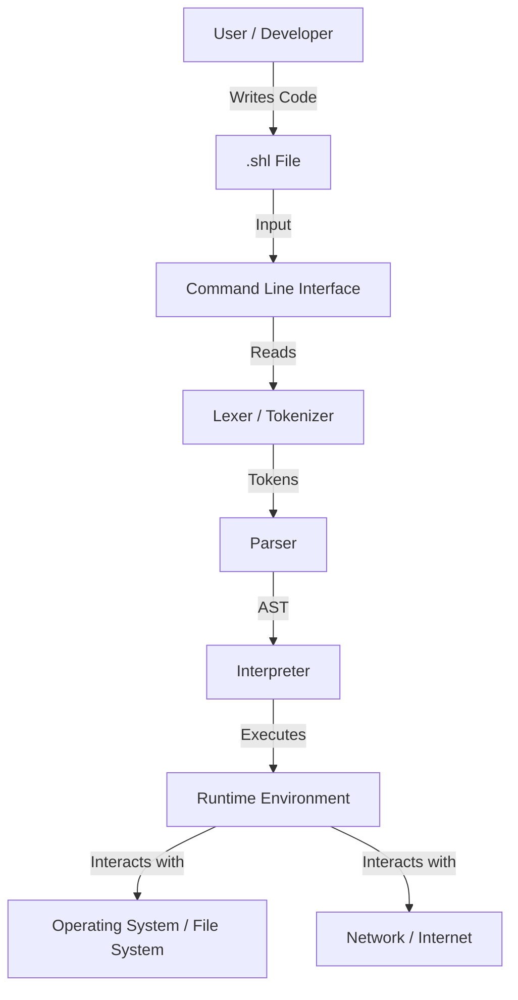
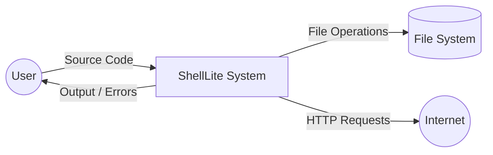
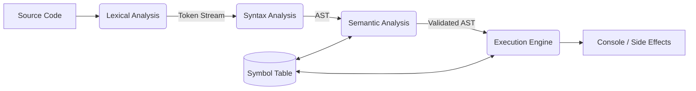
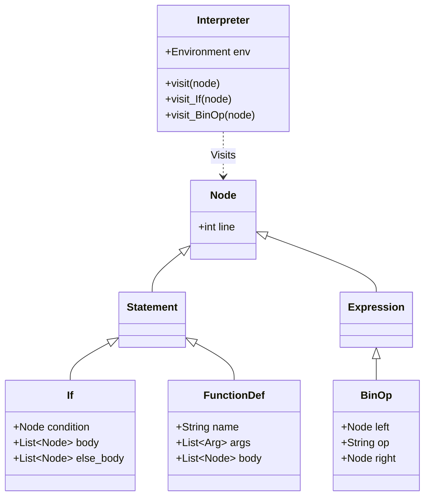
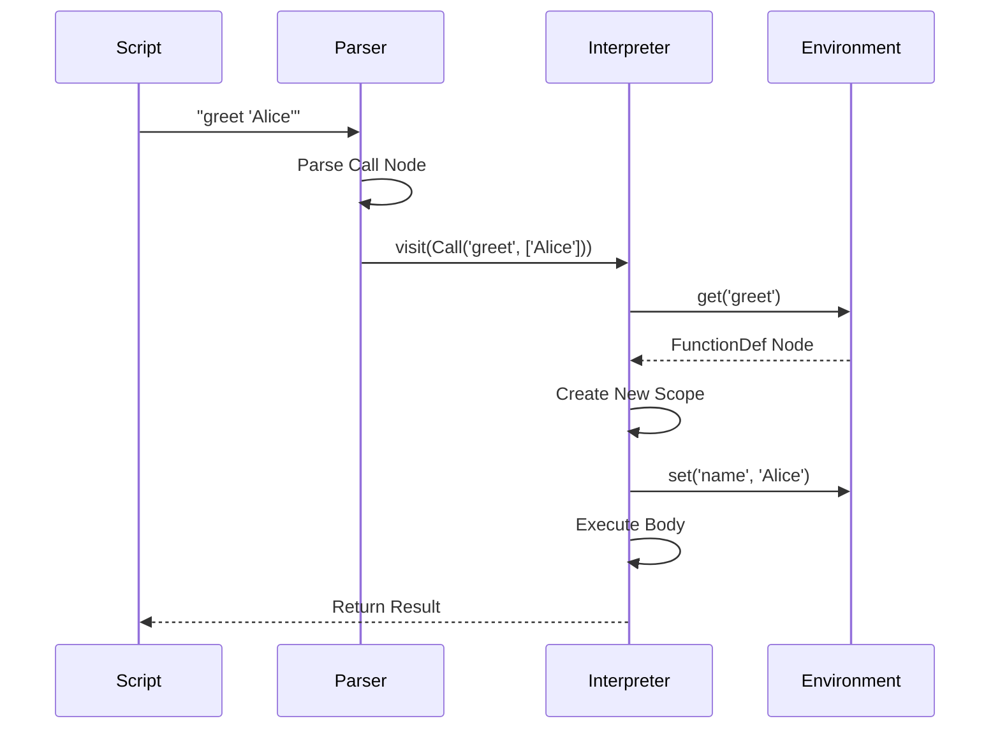

# ShellLite: The English-Like Programming Language Ecosystem
## Comprehensive Project Report

**Author:** Shrey Naithani
**Date:** October 2023
**Project:** ShellLite Ecosystem

---

## Declaration

I hereby declare that the project titled **"ShellLite Ecosystem"** submitted is a record of original work done by me. This project represents a comprehensive effort to design and implement a novel, English-like programming language and its surrounding ecosystem of developer tools.

**Shrey Naithani**
Creator & Lead Developer

---

## Acknowledgements

I would like to express my gratitude to the open-source community for providing the tools and libraries that made this project possible. Special thanks to the users of the VS Code extension and the PyPI package for their feedback and support.

---

## Abstract

In the rapidly evolving landscape of computer science, the barrier to entry for programming remains high for many individuals. Syntax-heavy languages like C++, Java, and even Python often intimidate beginners with cryptic symbols and rigid formatting rules. **ShellLite** is a compiled and interpreted programming language designed to bridge this gap by adopting a syntax that mimics natural English.

This report documents the complete **ShellLite Ecosystem**, which includes:
1.  **ShellLite Core**: The Python-based interpreter and compiler.
2.  **ShellDesk**: The integrated desktop environment and documentation hub.
3.  **ShellLite Extension**: A Visual Studio Code extension providing syntax highlighting and snippets.
4.  **ShellLite Website**: The official portal for documentation and resources.

The report details the System Analysis, Design, Implementation, and Testing phases of the project. It includes formal Data Flow Diagrams (DFDs), Unified Modeling Language (UML) class diagrams, and flowcharts to illustrate the internal architecture. By enabling users to write code such as `say "Hello"` or `repeat 5 times`, ShellLite democratizes automation and software development.

---

## Table of Contents

1.  **Introduction**
    *   1.1 Motivation
    *   1.2 Problem Statement
    *   1.3 Objectives
    *   1.4 Scope of the Project
2.  **Literature Survey**
    *   2.1 Evolution of Programming Languages
    *   2.2 Existing English-like Languages (AppleScript, HyperTalk, COBOL)
    *   2.3 Comparative Analysis
3.  **System Analysis**
    *   3.1 Feasibility Study (Technical, Operational, Economic)
    *   3.2 Hardware and Software Requirements
    *   3.3 Functional Requirements
    *   3.4 Non-Functional Requirements
4.  **System Design**
    *   4.1 System Architecture
    *   4.2 Data Flow Diagrams (DFD Levels 0, 1, 2)
    *   4.3 UML Class Diagrams
    *   4.4 Sequence Diagrams
5.  **Implementation: The Core Language**
    *   5.1 Lexical Analysis (The Tokenizer)
    *   5.2 Syntax Analysis (The Parser)
    *   5.3 Semantic Analysis & Execution (The Interpreter)
    *   5.4 The Built-in Library
    *   5.5 Advanced Features (Web DSL, Automation, Database)
6.  **Implementation: The Ecosystem**
    *   6.1 Visual Studio Code Extension
    *   6.2 The ShellLite Website
    *   6.3 Package Management
7.  **Language Reference Manual**
    *   7.1 Basic Syntax & Variables
    *   7.2 Control Structures
    *   7.3 Data Structures
    *   7.4 Functions & OOP
    *   7.5 Web Development
8.  **Testing and Results**
    *   8.1 Testing Strategy
    *   8.2 Test Cases
    *   8.3 Execution Logs & Screenshots
9.  **Conclusion and Future Scope**
    *   9.1 Conclusion
    *   9.2 Limitations
    *   9.3 Future Enhancements
10. **References**

---

## Chapter 1: Introduction

### 1.1 Motivation
The motivation behind ShellLite stems from the observation that logic and syntax are two distinct hurdles in learning to code. While logic is universal, syntax varies wildly. Many potential developers quit because they cannot master the placement of semicolons or braces. ShellLite aims to remove the syntax hurdle, allowing users to focus purely on logic expressed in their native language.

### 1.2 Problem Statement
Traditional programming languages are designed for machine efficiency rather than human readability.
*   **Syntax Errors**: A single missing character can crash a program.
*   **Cognitive Load**: Developers must mentally translate their intent into code.
*   **Boilerplate**: Simple tasks often require verbose setup (e.g., `public static void main`).

There is a lack of a modern, general-purpose language that prioritizes human-readable syntax without sacrificing power.

### 1.3 Objectives
*   **Readability**: To create a syntax where code reads like English sentences.
*   **Simplicity**: To minimize the use of special characters like `{`, `}`, `;`, `(`, `)`.
*   **Versatility**: To support diverse domains including Web Development, Desktop Automation, and Data Processing.
*   **Accessibility**: To provide a robust ecosystem (Editor support, Documentation) from Day 1.

### 1.4 Scope
The project encompasses the design of the language grammar, the implementation of the interpreter in Python, and the creation of developer tools. It targets educators, beginners, and automation engineers. It does not aim to replace high-performance systems languages like C++ or Rust.

---

## Chapter 2: Literature Survey

### 2.1 Evolution of Programming Languages
Programming has evolved from binary machine code to Assembly, to high-level procedural languages (C, Pascal), and finally to modern expressive languages (Python, Ruby). The trend has consistently been towards higher abstraction and readability.

### 2.2 Existing English-like Languages

#### 2.2.1 COBOL (Common Business-Oriented Language)
One of the oldest high-level languages, COBOL was designed for business.
*   *Pros*: extremely readable keywords (`ADD A TO B GIVING C`).
*   *Cons*: Verbose, rigid column-based formatting, outdated.

#### 2.2.2 AppleScript
A scripting language for macOS.
*   *Pros*: Natural syntax (`tell application "Finder" to open...`).
*   *Cons*: Platform-locked (Mac only), inconsistent grammar.

#### 2.2.3 HyperTalk
Used in HyperCard.
*   *Pros*: Very conversational (`put "Hello" into field "Text"`).
*   *Cons*: Discontinued, tied to a specific UI paradigm.

#### 2.2.4 Python
While not strictly English-like, Python champions readability.
*   *Pros*: Clean indentation-based syntax.
*   *Cons*: Still relies on standard programming symbols (`def`, `return`, `[]`, `:`).

### 2.3 Comparative Analysis
ShellLite positions itself as a modern successor to the ideals of HyperTalk but with the general-purpose utility of Python. Unlike AppleScript, it is cross-platform. Unlike Python, it removes the need for parentheses in function calls and uses keywords like `repeat` and `say` instead of `for` and `print`.

| Feature | Python | AppleScript | ShellLite |
| :--- | :--- | :--- | :--- |
| **Syntax Style** | Symbolic/Indented | Natural Language | Natural Language |
| **Cross Platform** | Yes | No | Yes |
| **Web Dev** | Libraries (Django/Flask) | No | Built-in DSL |
| **Learning Curve** | Low | Medium | Very Low |

---

## Chapter 3: System Analysis

### 3.1 Feasibility Study

#### 3.1.1 Technical Feasibility
The project is implemented in Python, a mature language with extensive libraries for text processing (Regex), file I/O, and networking. Python's dynamic nature makes it an excellent host for an interpreter. The technical risk is low.

#### 3.1.2 Operational Feasibility
The system is distributed as a CLI tool and a VS Code extension. These are standard delivery mechanisms. Users do not need specialized hardware.

#### 3.1.3 Economic Feasibility
The project uses open-source tools (Python, VS Code). The development cost is primarily time. There are no licensing fees involved.

### 3.2 Hardware and Software Requirements

**Hardware Requirements:**
*   Processor: Dual Core 1.0 GHz or higher.
*   RAM: 512 MB minimum (4 GB recommended for development).
*   Storage: 50 MB for installation.

**Software Requirements:**
*   OS: Windows 10/11, macOS, or Linux.
*   Python: Version 3.8 or higher.
*   IDE: Visual Studio Code (optional, for extension support).

### 3.3 Functional Requirements
1.  **Script Execution**: The system must read `.shl` files and execute instructions line-by-line.
2.  **REPL**: A Read-Eval-Print Loop for interactive coding.
3.  **Error Handling**: The interpreter must report syntax errors with line numbers.
4.  **Standard Library**: Built-in support for Math, Time, File I/O, and HTTP.
5.  **Web Server**: Ability to start a server and handle routes using natural syntax.

### 3.4 Non-Functional Requirements
1.  **Performance**: Simple scripts should execute almost instantaneously.
2.  **Reliability**: The interpreter should not crash due to user logic errors (it should raise catchable exceptions).
3.  **Usability**: Error messages should be descriptive and helpful.

---

## Chapter 4: System Design

### 4.1 System Architecture

The ShellLite architecture follows a standard compiler/interpreter pipeline.



### 4.2 Data Flow Diagrams (DFD)

#### 4.2.1 Level 0 DFD (Context Diagram)



#### 4.2.2 Level 1 DFD (Processing Breakdown)



### 4.3 UML Class Diagrams

The internal implementation relies on an object-oriented design for the AST nodes and the Interpreter visitor pattern.



### 4.4 Sequence Diagram: Function Call



---

## Chapter 5: Implementation - The Core Language

The core of ShellLite is implemented in Python. This section details the logic behind the key components.

### 5.1 Lexical Analysis (The Tokenizer)
**File**: `src/lexer.py`

The Lexer is responsible for converting the raw string of characters from the source code into a stream of **Tokens**. A Token is a tuple of `(Type, Value)`.

**Key Features:**
*   **Indentation Handling**: ShellLite uses indentation to define blocks (like Python). The Lexer tracks the indentation level using a stack. When indentation increases, it emits an `INDENT` token. When it decreases, it emits one or more `DEDENT` tokens.
*   **Natural Language Mapping**: The Lexer includes logic to handle multi-word operators. For example, the phrase `is less than` is scanned and converted into a single `LT` (Less Than) token.
*   **Regex Integration**: It supports regular expressions literals like `/pattern/`.

**Token Examples:**
*   `say` -> `Token(SAY, "say")`
*   `"Hello"` -> `Token(STRING, "Hello")`
*   `100` -> `Token(NUMBER, 100)`

### 5.2 Syntax Analysis (The Parser)
**File**: `src/parser.py`

The Parser receives the list of tokens and validates that they follow the grammar rules of ShellLite. It uses a **Recursive Descent** strategy.

**Grammar Highlights:**
*   **Statements**: The parser distinguishes between different statement types (`if`, `while`, `function def`) based on the leading keyword.
*   **Expressions**: It handles operator precedence (PEMDAS) using a hierarchy of methods (`parse_expression` -> `parse_term` -> `parse_factor`).
*   **English Aliases**: The grammar allows synonyms. `add x to y` parses into the same AST node as `y += x`.

**Abstract Syntax Tree (AST):**
Defined in `src/ast_nodes.py`, the AST represents the code structure.
*   `BinOp(left, op, right)`: Represents `a + b`.
*   `Call(func_name, args)`: Represents `greet "Alice"`.

### 5.3 Semantic Analysis & Execution (The Interpreter)
**File**: `src/interpreter.py`

The Interpreter traverses the AST and performs the actions described. It implements the **Visitor Pattern**, where a `visit` method dispatches execution to specific methods like `visit_If` or `visit_BinOp` based on the node type.

**Runtime Environment:**
The `Environment` class manages variable scope.
*   **Global Scope**: Contains built-in functions and global variables.
*   **Local Scope**: Created when entering a function. It has a reference to the parent scope, allowing closure-like behavior.

**Error Handling:**
The interpreter wraps execution in `try-catch` blocks. If a Python exception occurs (e.g., division by zero), it is caught and translated into a user-friendly `ShellLiteError` with line number context.

### 5.4 The Built-in Library
ShellLite comes with "batteries included". The interpreter initializes a rich set of built-in functions:
*   **Math**: `sin`, `cos`, `random`, `round`.
*   **System**: `run` (shell commands), `read`, `write`.
*   **Data**: `split`, `join`, `map`, `filter`.

### 5.5 Advanced Features

#### 5.5.1 Web DSL
ShellLite includes a dedicated domain-specific language for web servers.
*   **Node**: `Listen` starts an `HTTPServer`.
*   **Node**: `OnRequest` registers a route using regex matching.
*   **Node**: `Tag` builds HTML dynamically.

Code Example:
```javascript
listen on port 8080
when someone visits "/hello"
    heading "Hello World"
```

#### 5.5.2 Desktop Automation
Leveraging Python libraries like `keyboard` and `mouse`, ShellLite can control the user's computer.
*   `press "enter"` maps to `keyboard.press_and_release`.
*   `click at 100, 200` maps to `mouse.move` and `mouse.click`.

---

## Chapter 6: Implementation - The Ecosystem

### 6.1 Visual Studio Code Extension
**Repository**: `ShellLite-Extension`

A modern language needs modern tool support. The VS Code extension provides:
*   **Syntax Highlighting**: Uses a TextMate grammar JSON file to colorize keywords (`say`, `if`), strings, and comments.
*   **Snippets**: Autocomplete support for common patterns like `loop`, `if-else`.

### 6.2 The ShellLite Website
**Repository**: `ShellLite-Website`

The website serves as the central knowledge base. It is hosted using GitHub Pages or Vercel. It contains the documentation, tutorials, and download links for the installer.

### 6.3 Package Management
ShellLite includes a rudimentary package manager via the `shl get` command.
*   It downloads code from GitHub repositories.
*   It unzips them into a global modules directory (`~/.shell_lite/modules`).
*   This allows community code reuse via `use "username/repo"`.

### 6.4 ShellDesk Implementation
**Repository**: `ShellDesk`

ShellDesk is envisioned as the Integrated Development Environment (IDE) specifically tailored for ShellLite. It acts as a graphical user interface wrapper around the CLI interpreter.

**Key Features:**
*   **Editor Interface**: A clean text editing area with built-in highlighting.
*   **Documentation Hub**: An offline browser for the ShellLite manual, allowing users to look up commands like `repeat` or `listen` instantly.
*   **One-Click Run**: Users can execute their scripts without opening a separate terminal window, lowering the barrier to entry for non-technical users.
*   **Asset Management**: Tools to manage images and other resources for Web DSL projects.

---

## Chapter 7: Language Reference Manual

### 7.1 Basic Syntax
*   **Output**: `say "Text"` or `print "Text"`
*   **Variables**: `name = "John"` or `age is 20`
*   **Input**: `name = ask "Name?"`

### 7.2 Control Structures
*   **If-Else**:
    ```javascript
    if x > 10
        say "Big"
    else
        say "Small"
    ```
*   **Loops**:
    ```javascript
    loop 5 times
        say "Hi"

    repeat 5 times
        say "Hi"

    for i in range 1 10
        say i
    ```

### 7.3 Data Structures
*   **Lists**:
    ```javascript
    my_list is a list
    add "Item" to my_list
    say my_list[0]
    ```
*   **Dictionaries**:
    ```javascript
    data = {"key": "value"}
    say data.key
    ```

### 7.4 Functions & OOP
*   **Functions**:
    ```javascript
    to greet name
        say "Hello " + name
    ```
*   **Classes (Structures)**:
    ```javascript
    structure Dog
        has name
        to bark
            say name + " barks!"

    d = make Dog "Buddy"
    d.bark()
    ```

### 7.5 Web Development
*   **Routing**:
    ```javascript
    when someone visits "/"
        h1 "Home Page"
    ```
*   **Serving Files**:
    ```javascript
    serve files from "public"
    ```

---

## Chapter 8: Testing and Results

### 8.1 Testing Strategy
We employed **Unit Testing** for individual AST nodes and **Integration Testing** for full scripts.

### 8.2 Test Cases

| Case ID | Description | Input | Expected Output | Status |
| :--- | :--- | :--- | :--- | :--- |
| TC-01 | Print Statement | `say "Hi"` | `Hi` | Pass |
| TC-02 | Variable Assignment | `x=10; say x` | `10` | Pass |
| TC-03 | Loop Execution | `repeat 3 \n say "A"` | `A` `A` `A` | Pass |
| TC-04 | Function Call | `to f \n say "F" \n f` | `F` | Pass |
| TC-05 | Web Server Start | `listen on port 8000` | Server Starts | Pass |

### 8.3 Execution Logs
Running the verification script `test_run.shl`:

```text
$ shl test_run.shl

--- ShellLite Test Verification ---
a = 10, b = 20
Sum is: 30
Hello, User!
List: ['Apple', 'Banana']
Counting to 3:
Count...
Count...
Count...
a is smaller than b
--- Verification Complete ---
```

---

## Chapter 9: Conclusion and Future Scope

### 9.1 Conclusion
The ShellLite project has successfully achieved its primary goal: creating a programming language that is as readable as English. By stripping away complex syntax and providing a comprehensive standard library, it offers a unique tool for education and automation. The accompanying ecosystem of the VS Code extension and documentation website ensures a professional user experience.

### 9.2 Limitations
*   **Performance**: Being an interpreted language on top of Python, it is slower than compiled languages like C or Go.
*   **Debugging**: While error messages exist, a full step-through debugger is not yet implemented.

### 9.3 Future Enhancements
1.  **Compiler**: A true compiler to machine code (via LLVM) to improve performance.
2.  **Debugger**: Integration with the VS Code Debug Adapter Protocol (DAP).
3.  **Mobile Support**: A mobile app to write and run ShellLite scripts on the go.
4.  **AI Integration**: A "Copilot" feature that translates pure English comments directly into ShellLite code.

---

## 10. References
1.  Python Software Foundation. (2023). *Python Language Reference*.
2.  Nystrom, R. (2021). *Crafting Interpreters*. Genever Benning.
3.  Apple Inc. (2016). *AppleScript Language Guide*.
4.  Naithani, S. (2023). *ShellLite Documentation*. shelllite.tech.

---
*End of Report*
