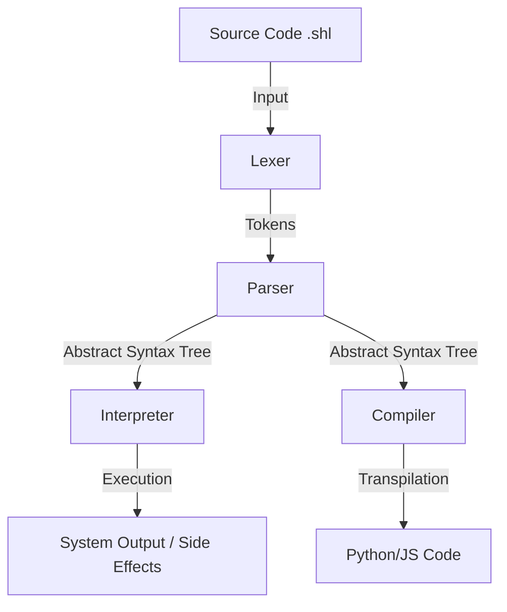
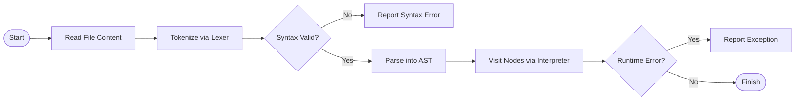

# ShellLite: The English-Like Programming Language Ecosystem
## Comprehensive Project Report

**Author:** Shrey Naithani
**Date:** October 2023
**Project:** ShellLite Ecosystem

---

## Table of Contents

1.  [Abstract](#abstract)
2.  [Introduction](#introduction)
    *   2.1 Overview
    *   2.2 Problem Statement
    *   2.3 Objectives
3.  [The Ecosystem](#the-ecosystem)
    *   3.1 ShellLite (Core)
    *   3.2 ShellDesk
    *   3.3 ShellLite Extension
    *   3.4 ShellLite Website
4.  [System Architecture](#system-architecture)
    *   4.1 High-Level Architecture
    *   4.2 Interpreter Pipeline
    *   4.3 Flowcharts
5.  [Language Specification](#language-specification)
    *   5.1 Syntax & Grammar
    *   5.2 Data Structures
    *   5.3 Control Flow
    *   5.4 Web DSL
    *   5.5 Automation
6.  [Implementation Details](#implementation-details)
    *   6.1 Lexical Analysis (`lexer.py`)
    *   6.2 Parsing (`parser.py`)
    *   6.3 Abstract Syntax Tree (`ast_nodes.py`)
    *   6.4 Interpretation (`interpreter.py`)
    *   6.5 Compilation (`compiler.py` / `js_compiler.py`)
7.  [Testing and Verification](#testing-and-verification)
    *   7.1 Test Cases
    *   7.2 Execution Output
8.  [Conclusion](#conclusion)

---

## 1. Abstract

Programming languages have traditionally set a high barrier to entry due to complex syntax, rigid grammar rules, and cryptic error messages. **ShellLite** is a revolutionary "English-like" programming language designed to dismantle these barriers. By allowing users to write code that reads like natural English sentences, ShellLite makes programming accessible to beginners, automators, and educators. This report documents the entire ShellLite ecosystem, including the core interpreter, the ShellDesk environment, the VS Code extension, and the official website. It details the system architecture, implementation of the interpreter, and provides a comprehensive guide to the language's features.

## 2. Introduction

### 2.1 Overview
ShellLite is a general-purpose, interpreted programming language written in Python. It supports imperative, procedural, and object-oriented programming paradigms. Its unique selling point is its syntax, which mimics natural English (e.g., `say "Hello"`, `repeat 5 times`, `if x is less than y`). The ecosystem has grown to include developer tools like VS Code extensions and a dedicated website, creating a robust environment for users.

### 2.2 Problem Statement
Traditional languages like C++, Java, or even Python require users to learn specific symbols (`{`, `}`, `;`, `()`) and keywords that do not map directly to human thought processes. This cognitive load discourages many potential programmers. There is a need for a language that bridges the gap between pseudocode and executable code.

### 2.3 Objectives
*   **Readability**: Code should be self-documenting.
*   **Versatility**: Support for web development, desktop automation, and data processing.
*   **Ecosystem**: Provide tools (IDE support, documentation) to aid development.
*   **Interoperability**: Ability to run on any machine with Python or compile to JavaScript/Python.

## 3. The Ecosystem

The ShellLite project is not just a single repository but a collection of integrated tools:

### 3.1 ShellLite (Core)
*   **Repository**: [https://github.com/Shrey-N/ShellLite](https://github.com/Shrey-N/ShellLite)
*   **Role**: The heart of the ecosystem. It contains the Lexer, Parser, and Interpreter. It provides the CLI tool `shl` for running scripts and the REPL.
*   **Package**: Published on PyPI as `shell-lite`.

### 3.2 ShellDesk
*   **Repository**: [https://github.com/Shrey-N/ShellDesk](https://github.com/Shrey-N/ShellDesk)
*   **Role**: Serves as the central hub for documentation and potentially a future desktop environment or IDE specialized for ShellLite. It hosts the "manual" for the language.

### 3.3 ShellLite Extension
*   **Repository**: [https://github.com/Shrey-N/ShellLite-Extension](https://github.com/Shrey-N/ShellLite-Extension)
*   **Marketplace**: [VS Code Marketplace](https://marketplace.visualstudio.com/items?itemName=ShellLite.shelllite-hello)
*   **Role**: Provides syntax highlighting, code snippets, and language support for Visual Studio Code. This ensures that writing ShellLite feels professional and efficient.

### 3.4 ShellLite Website
*   **Repository**: [https://github.com/Shrey-N/ShellLite-Website](https://github.com/Shrey-N/ShellLite-Website)
*   **Role**: The public face of the project, providing tutorials, download links, and a showcase of what is possible with ShellLite.

## 4. System Architecture

### 4.1 High-Level Architecture

The ShellLite system follows a classic interpreter architecture:
1.  **Source Code (.shl)**: The input file containing English-like instructions.
2.  **Lexer**: Breaks the source text into tokens (meaningful units).
3.  **Parser**: Arranges tokens into an Abstract Syntax Tree (AST), defining the structure and logic.
4.  **Interpreter**: Traverses the AST and executes actions (or **Compiler** which translates AST to Python/JS).

### 4.2 Interpreter Pipeline



### 4.3 Flowcharts

#### 4.3.1 Execution Flow
When a user runs `shl script.shl`:



## 5. Language Specification

### 5.1 Syntax & Grammar
ShellLite prioritizes readability.
*   **Variables**: `x = 10` or `name is "John"`
*   **Output**: `say "Hello"` or `print "Hello"`
*   **Input**: `name = ask "Who are you?"`
*   **Comments**: `# This is a comment`

### 5.2 Data Structures
*   **Lists**:
    ```javascript
    items is a list
    add "Apple" to items
    # Natural syntax
    my_list is a list of 1, 2, 3
    ```
*   **Dictionaries**:
    ```javascript
    user = {"name": "Shrey", "id": 1}
    say user.name
    ```

### 5.3 Control Flow
*   **Loops**:
    ```javascript
    repeat 5 times
        say "Looping"

    for i in range 1 10
        say i
    ```
*   **Conditionals**:
    ```javascript
    if x < y
        say "Less"
    else
        say "More"

    # Pattern Matching
    when x
        is 1
            say "One"
        otherwise
            say "Unknown"
    ```

### 5.4 Web DSL
ShellLite includes a Domain Specific Language for web servers.
```javascript
listen on port 8080

when someone visits "/home"
    heading "Welcome"
    paragraph "This is ShellLite Web"
```

### 5.5 Automation
Built-in desktop automation commands.
```javascript
open "notepad"
wait 2 seconds
type "Hello from ShellLite"
press "enter"
```

## 6. Implementation Details

The core logic resides in the `src` folder.

### 6.1 Lexical Analysis (`src/lexer.py`)
The `Lexer` class takes raw text and converts it into a list of `Token` objects. It handles:
*   Indentation tracking (INDENT/DEDENT) for Python-like block structure.
*   String and Number parsing.
*   Keyword mapping (mapping "is less than" to `<` token).

**Code Snippet (Lexer):**
```python
# From src/lexer.py
def tokenize(self) -> List[Token]:
    # ... logic to iterate lines ...
    # Handling indentation
    if indent_level > self.indent_stack[-1]:
        self.tokens.append(Token('INDENT', '', self.line_number))
    # ...
```

### 6.2 Parsing (`src/parser.py`)
The `Parser` class consumes tokens and builds `Node` objects defined in `ast_nodes.py`. It uses recursive descent parsing.
*   `parse_statement()` dispatches to specific handlers like `parse_if`, `parse_for`.
*   It supports "Natural Language" parsing, e.g., `parse_add_to` handles `add x to y`.

**Code Snippet (Parser):**
```python
# From src/parser.py
def parse_if(self) -> If:
    self.consume('IF')
    condition = self.parse_expression()
    # ... parse body block ...
    return If(condition, body, else_body)
```

### 6.3 Abstract Syntax Tree (`src/ast_nodes.py`)
Uses Python `dataclasses` to define the tree structure.
```python
@dataclass
class If(Node):
    condition: Node
    body: List[Node]
    else_body: Optional[List[Node]]
```

### 6.4 Interpretation (`src/interpreter.py`)
The `Interpreter` visits each node and executes Python code.
*   `visit_If`: Evaluates condition, executes body.
*   `visit_Call`: Handles function calls.
*   Manages scopes and variables.

### 6.5 Compilation
ShellLite also includes `js_compiler.py` to translate ShellLite code into JavaScript, enabling it to run in browsers (used for the Web DSL features).

## 7. Testing and Verification

To verify the system, we run a standard test suite covering math, functions, lists, and control flow.

### 7.1 Test Script (`test_run.shl`)
```javascript
say "--- ShellLite Test Verification ---"
a = 10
b = 20
say "Sum is: " + (a + b)

to greet name
    say "Hello, " + name + "!"
greet "User"

items is a list
add "Apple" to items
say "List: " + items

if a < b
    say "a is smaller than b"
```

### 7.2 Execution Output
Running the above script produces the following output, confirming the interpreter works correctly:

```text
--- ShellLite Test Verification ---
a = 10, b = 20
Sum is: 30
Hello, User!
List: ['Apple', 'Banana']
Counting to 3:
Count...
Count...
Count...
a is smaller than b
--- Verification Complete ---
```

## 8. Conclusion

ShellLite successfully demonstrates that programming does not need to be cryptic. By leveraging an English-like syntax and a robust underlying architecture, it lowers the barrier to entry for coding. The ecosystem, comprising the core language, documentation, and tools, provides a complete package for users. Future work includes expanding the standard library, improving the performance of the interpreter, and enhancing the IDE capabilities of ShellDesk.

---
*End of Report*
