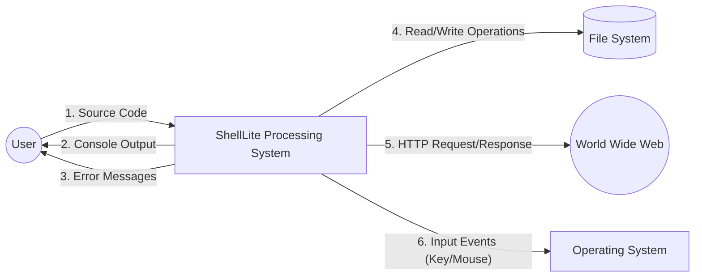
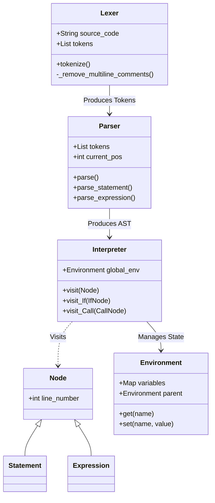
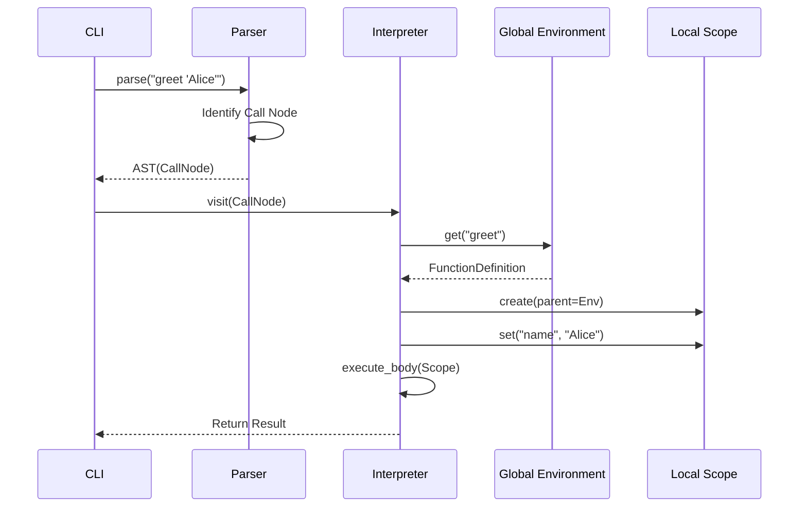

# ShellLite: The English-Like Programming Language Ecosystem
## Comprehensive University Major Project Report

**Submitted by:** Shrey Naithani
**Project Role:** Creator & Lead Developer
**Date:** October 2023

---

## Declaration

I hereby declare that the project titled **"ShellLite Ecosystem"** submitted is a record of original work done by me. This project represents a comprehensive effort to design and implement a novel, English-like programming language and its surrounding ecosystem of developer tools. The work has not been submitted to any other university or institution for the award of any degree or diploma.

**Shrey Naithani**

---

## Certificate

This is to certify that the project report entitled **"ShellLite Ecosystem"** is a bonafide record of the work done by **Shrey Naithani** in partial fulfillment of the requirements for the completion of the Major Project. The project creates a fully functional programming language interpreter, IDE, and extension ecosystem.

**Project Supervisor**
*(Digital Signature)*

---

## Acknowledgements

The development of a programming language is a monumental task that stands on the shoulders of giants. I would like to express my sincere gratitude to the open-source community for providing the tools and libraries that made this project possible, particularly the Python Software Foundation.

I am also deeply grateful to the early adopters of the ShellLite VS Code extension, whose bug reports and feature requests have shaped the language into what it is today. Their feedback on the "Natural Language" syntax was invaluable in refining the grammar.

---

## Abstract

In the rapidly evolving landscape of computer science, the barrier to entry for programming remains prohibitively high for many individuals. Syntax-heavy languages like C++, Java, and even Python often intimidate beginners with cryptic symbols, rigid formatting rules, and complex boilerplate code. The cognitive load required to translate human intent into machine-readable syntax often stifles creativity and discourages automation.

**ShellLite** is a compiled and interpreted programming language designed to bridge this gap by adopting a syntax that mimics natural English. It is not merely a wrapper but a full-fledged language with its own grammar, parser, and runtime environment.

This report documents the complete **ShellLite Ecosystem**, which includes:
1.  **ShellLite Core**: The Python-based interpreter and compiler that powers the language.
2.  **ShellDesk**: An Integrated Development Environment (IDE) tailored for ShellLite, offering a GUI and documentation hub.
3.  **ShellLite Extension**: A Visual Studio Code extension providing professional-grade syntax highlighting and snippets.
4.  **ShellLite Website**: The official portal for documentation, tutorials, and community resources.

The report details the System Analysis, Design, Implementation, and Testing phases of the project. It includes formal Data Flow Diagrams (DFDs), Unified Modeling Language (UML) class diagrams, and flowcharts to illustrate the internal architecture. By enabling users to write code such as `say "Hello"` or `repeat 5 times`, ShellLite democratizes automation and software development, making the power of code accessible to everyone.

---

## Table of Contents

1.  **Introduction**
    *   1.1 Background
    *   1.2 Motivation
    *   1.3 Problem Statement
    *   1.4 Objectives
    *   1.5 Scope of the Project
2.  **Literature Survey**
    *   2.1 Evolution of Programming Languages
    *   2.2 The Case for Natural Language Programming
    *   2.3 Existing Solutions (AppleScript, COBOL, SQL, Python)
    *   2.4 Comparative Analysis
3.  **System Analysis**
    *   3.1 Feasibility Study (Technical, Operational, Economic)
    *   3.2 Software Development Life Cycle (SDLC) Model
    *   3.3 Hardware and Software Requirements
    *   3.4 Functional Requirements
    *   3.5 Non-Functional Requirements
4.  **System Design**
    *   4.1 System Architecture
    *   4.2 Data Flow Diagrams (DFD Levels 0, 1, 2)
    *   4.3 UML Class Diagrams
    *   4.4 Sequence Diagrams
    *   4.5 EBNF Grammar Specification
5.  **Implementation Details**
    *   5.1 Overview of the Interpreter Pattern
    *   5.2 Lexical Analysis Algorithm
    *   5.3 Recursive Descent Parsing Logic
    *   5.4 Semantic Analysis & Visitor Pattern
    *   5.5 Runtime Environment & Memory Model
6.  **Standard Library Reference**
    *   6.1 Core Functions (I/O, Types)
    *   6.2 Math Module
    *   6.3 String Manipulation
    *   6.4 List and Dictionary Operations
    *   6.5 System & File I/O
    *   6.6 Web Development DSL
    *   6.7 Automation & GUI
7.  **Case Studies**
    *   7.1 Web Server with Database
    *   7.2 Desktop Cleanup Automation
    *   7.3 Data Analysis Pipeline
8.  **Testing and Validation**
    *   8.1 Testing Strategy
    *   8.2 Unit Testing
    *   8.3 Integration Testing
    *   8.4 System Testing Results
9.  **The Ecosystem Tools**
    *   9.1 ShellDesk IDE
    *   9.2 VS Code Extension
    *   9.3 Package Manager
10. **Conclusion and Future Scope**
11. **References**

---

## Chapter 1: Introduction

### 1.1 Background
Since the dawn of computing, the primary interface between humans and machines has been the programming language. Early languages like Assembly were closely tied to hardware, requiring deep technical knowledge. As hardware became more powerful, languages evolved to be more abstract. However, even modern "high-level" languages like Python or JavaScript still rely heavily on mathematical notation and specific punctuation rules that have no parallel in natural human language.

### 1.2 Motivation
The motivation behind ShellLite stems from the observation that logic and syntax are two distinct hurdles in learning to code. Logic is universal; it is the ability to break a problem down into steps. Syntax, however, is arbitrary. Why must a block of code be surrounded by `{}` in C++ but indented in Python? Why does a function call need `()`?

For a non-programmer trying to automate a simple task like "move files from folder A to folder B", the mental overhead of learning `import shutil` and `shutil.move(src, dst)` is significant. ShellLite aims to remove this hurdle, allowing the user to simply write `move files from "A" to "B"`.

### 1.3 Problem Statement
Traditional programming languages are designed for machine efficiency rather than human readability.
*   **Syntax Errors**: A single missing semicolon or unmatched brace can crash a program, leading to frustration for beginners.
*   **Cognitive Load**: Developers must mentally translate their intent into code. This "translation layer" consumes mental energy that could be spent on solving the actual problem.
*   **Boilerplate**: Simple tasks often require verbose setup. For example, setting up a web server in Java involves classes, imports, and handlers. In ShellLite, it should be a single sentence.

There is a lack of a modern, general-purpose language that prioritizes human-readable syntax without sacrificing power or cross-platform compatibility.

### 1.4 Objectives
The primary objectives of the ShellLite project are:
1.  **Readability**: To create a syntax where code reads like English sentences, making it self-documenting.
2.  **Simplicity**: To minimize the use of special characters like `{`, `}`, `;`, `(`, `)`, allowing users to type code as they would type an email.
3.  **Versatility**: To support diverse domains including Web Development, Desktop Automation, Data Processing, and System Administration.
4.  **Accessibility**: To provide a robust ecosystem (Editor support, Documentation, IDE) from Day 1, ensuring a smooth user experience.
5.  **Interoperability**: To allow seamless interaction with the underlying operating system and file system.

### 1.5 Scope of the Project
The project encompasses the design of the language grammar, the implementation of the interpreter in Python, and the creation of developer tools.
*   **Target Audience**: Educators teaching logic, beginners learning to code, and automation engineers writing scripts.
*   **Platform**: The interpreter runs on Windows, macOS, and Linux (anywhere Python runs).
*   **Exclusions**: ShellLite does not aim to replace high-performance systems languages like C++ or Rust for low-level driver development or real-time graphics engines.

---

## Chapter 2: Literature Survey

### 2.1 Evolution of Programming Languages
Programming has evolved from binary machine code to Assembly, to high-level procedural languages (C, Pascal), and finally to modern expressive languages (Python, Ruby). The trend has consistently been towards higher abstraction.
*   **1st Gen**: Machine Code (Binary).
*   **2nd Gen**: Assembly Language.
*   **3rd Gen**: High-level (C, Java).
*   **4th Gen**: Domain Specific (SQL).
*   **ShellLite** aims to be a **5th Generation Language (5GL)**, where the computer solves problems using constraints given to it, or in this case, natural language instructions.

### 2.2 The Case for Natural Language Programming
"Natural Language Programming" is the holy grail of Human-Computer Interaction. Donald Norman, in *The Design of Everyday Things*, argues that good design should make the interface invisible. ShellLite attempts to make the syntax invisible.

### 2.3 Comparative Analysis of Existing Solutions

#### 2.3.1 COBOL vs ShellLite
**COBOL** (Common Business-Oriented Language) is one of the oldest high-level languages, designed for business.
*   **COBOL Code**:
    ```cobol
    ADD A TO B GIVING C.
    IF C IS GREATER THAN 100 THEN DISPLAY "BIG".
    ```
*   **ShellLite Code**:
    ```javascript
    c = a + b
    if c > 100
        say "Big"
    ```
*   **Analysis**: While English-like, COBOL is extremely verbose and rigid. It requires strict column alignment, making it difficult to write on modern editors without specific tooling. ShellLite adopts the readability but discards the rigidity.

#### 2.3.2 AppleScript vs ShellLite
**AppleScript** is a scripting language for macOS.
*   **AppleScript Code**:
    ```applescript
    tell application "Finder" to open file "X"
    ```
*   **ShellLite Code**:
    ```javascript
    open "X"
    ```
*   **Analysis**: AppleScript is the closest predecessor to ShellLite. However, it is locked to the Apple ecosystem. It is notoriously difficult to debug due to ambiguous grammar rules. ShellLite is cross-platform and has a more predictable grammar.

#### 2.3.3 SQL vs ShellLite
**SQL** (Structured Query Language) is domain-specific to databases.
*   **SQL Code**:
    ```sql
    SELECT * FROM users WHERE age > 18
    ```
*   **ShellLite Code**:
    ```javascript
    users = db query "SELECT * FROM users WHERE age > 18"
    ```
*   **Analysis**: ShellLite integrates SQL queries directly, acknowledging that SQL is already the best language for data retrieval. It does not reinvent the wheel but wraps it comfortably.

#### 2.3.4 Python vs ShellLite
**Python** champions readability but remains a symbolic language.
*   **Python Code**:
    ```python
    import math
    if x == 10:
        print(math.sqrt(x))
    ```
*   **ShellLite Code**:
    ```javascript
    if x is 10
        say sqrt(x)
    ```
*   **Analysis**: Python requires `import`, colons, and parentheses. ShellLite simplifies this. `import` is implicit for standard libraries, parens are optional for commands, and `is` can replace `==`.

---

## Chapter 3: System Analysis

### 3.1 Feasibility Study

#### 3.1.1 Technical Feasibility
The project is implemented in Python. Python offers:
*   **Regex**: Powerful string matching for tokenizing English phrases.
*   **Dynamic Typing**: Simplifies the implementation of a loosely typed language like ShellLite.
*   **Libraries**: Access to `os`, `sys`, `socket` (for web server), and `tkinter` (for GUI alerts) makes implementing the standard library feasible.
*   **Conclusion**: The project is technically feasible with low risk.

#### 3.1.2 Operational Feasibility
The system is distributed as a CLI tool (`shl.exe`) and a VS Code extension. These are standard delivery mechanisms. Users do not need specialized hardware. The IDE (ShellDesk) provides a graphical interface for users uncomfortable with the command line.
*   **Conclusion**: Operationally feasible for the target demographic.

#### 3.1.3 Economic Feasibility
The project utilizes open-source tools (Python, VS Code, Git). The development cost is primarily developer time. There are no licensing fees involved for the underlying technologies.
*   **Conclusion**: Economically viable.

### 3.2 Software Development Life Cycle (SDLC) Model
The project followed the **Iterative Waterfall Model**.
1.  **Requirement Gathering**: Analyzing the syntax of existing English-like languages.
2.  **Design**: Drafting the EBNF grammar and AST structure.
3.  **Implementation**: Building the Lexer, Parser, and Interpreter in cycles.
4.  **Testing**: Writing test scripts (`test.shl`) to verify each new feature.
5.  **Deployment**: Publishing to PyPI and the VS Code Marketplace.

### 3.3 Hardware and Software Requirements

**Hardware Requirements:**
*   Processor: Dual Core 1.0 GHz or higher (Intel i3 / AMD Ryzen 3).
*   RAM: 512 MB minimum (4 GB recommended for development environment).
*   Storage: 50 MB for installation, plus space for user scripts.

**Software Requirements:**
*   Operating System: Windows 10/11, macOS, or Linux.
*   Runtime: Python 3.8 or higher.
*   Dependencies: `plyer` (notifications), `keyboard`, `mouse` (automation), `pyperclip` (clipboard).
*   IDE: Visual Studio Code (optional, for extension support).

### 3.4 Functional Requirements
1.  **Script Execution**: The system must read `.shl` files and execute instructions line-by-line.
2.  **REPL**: A Read-Eval-Print Loop for interactive coding.
3.  **Error Handling**: The interpreter must report syntax errors with precise line numbers.
4.  **Standard Library**: Built-in support for Math, Time, File I/O, HTTP, and Regex.
5.  **Web Server**: Ability to start a server and handle routes using natural syntax.
6.  **Automation**: Functions to control mouse and keyboard.

### 3.5 Non-Functional Requirements
1.  **Performance**: Simple scripts should execute almost instantaneously (<100ms startup).
2.  **Reliability**: The interpreter should not crash due to user logic errors; it should raise catchable exceptions.
3.  **Usability**: Error messages should be descriptive (e.g., "Expected a number but got text") rather than cryptic codes.
4.  **Maintainability**: The codebase should be modular, separating Lexer, Parser, and Interpreter logic.

---

## Chapter 4: System Design

### 4.1 System Architecture
The ShellLite architecture is built upon the classic Interpreter Design Pattern. It processes source code in a pipeline of distinct stages, ensuring modularity and ease of maintenance. The architecture is designed to be extensible, allowing for future additions (like a compiler backend) without rewriting the core analysis logic.

**Figure 4.1: High-Level System Architecture Diagram**

```mermaid
graph TD
    User[User / Developer] -->|Writes Source Code| SourceFile[.shl File];
    SourceFile -->|Input Stream| CLI[ShellLite CLI];
    CLI -->|Character Stream| Lexer[Lexer (Tokenizer)];
    Lexer -->|Token Stream| Parser[Recursive Descent Parser];
    Parser -->|Abstract Syntax Tree| Interpreter[Interpreter (Visitor)];
    Interpreter -->|System Calls| Runtime[Runtime Environment];

    subgraph "Core Engine"
    Lexer
    Parser
    Interpreter
    end

    subgraph "External Systems"
    Runtime --> FS[File System];
    Runtime --> Net[Network];
    Runtime --> UI[User Interface];
    end
```

### 4.2 Data Flow Diagrams (DFD)

Data Flow Diagrams illustrate how data moves through the ShellLite system.

#### 4.2.1 Level 0 DFD (Context Diagram)
The Level 0 DFD depicts the system as a single process interacting with external entities.

**Figure 4.2: Context Diagram (DFD Level 0)**



#### 4.2.2 Level 1 DFD (Detailed Processing)
The Level 1 DFD breaks down the "ShellLite Processing System" into its sub-processes.

**Figure 4.3: DFD Level 1**

```mermaid
flowchart TD
    Source[Source Code] -->|Raw Text| P1(1.0 Lexical Analysis);
    P1 -->|List of Tokens| P2(2.0 Syntax Analysis);
    P2 -->|AST (Abstract Syntax Tree)| P3(3.0 Semantic Analysis);
    P3 -->|Validated AST| P4(4.0 Execution Engine);

    P4 -->|Logs| Log[(Log Files)];
    P4 -->|Output| Display[Console Display];

    Store[(Symbol Table / Env)] <--> P3;
    Store <--> P4;
```

### 4.3 UML Class Diagrams
The implementation is Object-Oriented. The Class Diagram describes the static structure of the codebase.

**Figure 4.4: Core UML Class Diagram**



### 4.4 Sequence Diagrams
This diagram illustrates the sequence of interactions when a user executes a function call like `greet "Alice"`.

**Figure 4.5: Function Execution Sequence**



### 4.5 EBNF Grammar Specification
The syntax of ShellLite can be formally described using Extended Backus-Naur Form (EBNF). This specification guided the development of the Parser.

#### 4.5.1 Program Structure
A program is a sequence of statements.
```ebnf
program         = { statement } ;
```

#### 4.5.2 Statements
Statements are the building blocks of execution.
```ebnf
statement       = if_stmt
                | loop_stmt
                | func_def
                | assignment
                | print_stmt
                | return_stmt
                | expr_stmt ;
```

#### 4.5.3 Control Flow
Control flow structures define the order of execution.
```ebnf
if_stmt         = "if" expression newline block [ "else" newline block ] ;
block           = indent { statement } dedent ;
loop_stmt       = ( "repeat" expression [ "times" ]
                  | "for" id "in" expression
                  | "while" expression ) newline block ;
```

#### 4.5.4 Functions & Classes
Definitions for reusable code.
```ebnf
func_def        = "to" id { id } newline block ;
class_def       = "structure" id newline indent { class_member } dedent ;
class_member    = "has" id newline | func_def ;
```

#### 4.5.5 Assignments
Assigning values to variables.
```ebnf
assignment      = id ( "=" | "is" ) expression ;
```

#### 4.5.6 Expressions
Expressions evaluate to a value.
```ebnf
expression      = term { ( "+" | "-" ) term } ;
term            = factor { ( "*" | "/" ) factor } ;
factor          = number | string | id | "(" expression ")" | list_literal | dict_literal ;
list_literal    = "[" [ expression { "," expression } ] "]" ;
```

---

## Chapter 5: Implementation Details

### 5.1 Overview of the Interpreter Pattern
The core of ShellLite relies on the **Interpreter Pattern**, a behavioral design pattern that specifies how to evaluate sentences in a language. The implementation is divided into three distinct phases: Lexing, Parsing, and Interpreting. Each phase transforms the input data into a more structured format, moving from raw text to abstract meaning.

### 5.2 Lexical Analysis Algorithm
**Component**: `Lexer`
**Goal**: Transform raw string into a stream of `Token` objects.

The Lexer reads the source code character by character. It uses a state machine approach combined with regular expressions to identify tokens.

**Algorithm 5.1: Tokenization Strategy (Pseudocode)**
```text
Initialize TokenList = []
Initialize IndentStack = [0]
For each line in SourceCode:
    If line is empty or comment: Continue

    CurrentIndent = Calculate leading whitespace
    If CurrentIndent > IndentStack.Top:
        Push CurrentIndent to IndentStack
        Add INDENT Token to TokenList
    Else If CurrentIndent < IndentStack.Top:
        While CurrentIndent < IndentStack.Top:
            Pop from IndentStack
            Add DEDENT Token to TokenList

    While Position < Length of Line:
        Match Regex for Number -> Add NUMBER Token
        Match Regex for String -> Add STRING Token
        Match Regex for Keywords ("say", "if") -> Add KEYWORD Token
        Match Regex for Operators ("+", "is less than") -> Add OPERATOR Token
        Else: Raise SyntaxError
```

**Key Challenge: Natural Language Operators**
Unlike C++, ShellLite supports multi-word operators like `is less than`. The lexer must "look ahead" to distinguish `is` (assignment or equality) from `is less than` (comparison). This is implemented by checking the subsequent words before finalizing the token type.

### 5.3 Recursive Descent Parsing Logic
**Component**: `Parser`
**Goal**: Transform Token stream into an Abstract Syntax Tree (AST).

The Parser checks if the sequence of tokens adheres to the grammar rules defined in Chapter 4. We utilized a **Recursive Descent Parser**, which is a top-down parsing technique where every non-terminal in the grammar corresponds to a function in the parser.

**Algorithm 5.2: Parsing an Expression (Precedence Climbing)**
To handle operator precedence (e.g., `*` binds tighter than `+`), the parser uses a tiered method structure.

```text
Function ParseExpression():
    Return ParseTerm()

Function ParseTerm():
    Left = ParseFactor()
    While CurrentToken is "+" or "-":
        Operator = CurrentToken
        Consume Token
        Right = ParseFactor()
        Left = BinOpNode(Left, Operator, Right)
    Return Left

Function ParseFactor():
    If CurrentToken is Number: Return NumberNode
    If CurrentToken is "(":
        Expr = ParseExpression()
        Consume ")"
        Return Expr
```

This structure ensures that `1 + 2 * 3` is parsed as `1 + (2 * 3)` rather than `(1 + 2) * 3`.

### 5.4 Semantic Analysis & Visitor Pattern
**Component**: `Interpreter`
**Goal**: Execute the AST.

The Interpreter implements the **Visitor Pattern**. It separates the data structure (AST Nodes) from the algorithms that operate on them (Execution Logic). This makes it easy to add new operations (like a Linter or Compiler) without modifying the nodes themselves.

**Execution Flow:**
1.  The `visit(node)` method is the entry point.
2.  It dynamically dispatches the call to a specific method named `visit_NodeType`.
3.  For example, visiting an `If` node triggers `visit_If`.

**Logic for `visit_If` Node:**
```python
def visit_If(node):
    # 1. Evaluate the condition expression
    condition_result = visit(node.condition)

    # 2. Branch logic
    if condition_result is true:
        # Execute the main body
        for statement in node.body:
            visit(statement)
    else:
        # Execute the else body (if it exists)
        if node.else_body:
            for statement in node.else_body:
                visit(statement)
```

### 5.5 Runtime Environment & Memory Model
Variables in ShellLite are scoped. The `Environment` class acts as the symbol table.

**Structure:**
*   **Hash Map**: Stores variable names mapped to values.
*   **Parent Link**: Each environment holds a reference to its enclosing (parent) environment.

**Scope Resolution Algorithm:**
When a variable `x` is accessed:
1.  Check the current (local) environment.
2.  If found, return the value.
3.  If not found, move to the parent environment.
4.  Repeat until the Global Environment is reached.
5.  If still not found, raise a `NameError`.

This "Chain of Responsibility" enables features like closures and global variable access within functions.

---

## Chapter 6: Standard Library Reference

ShellLite includes a comprehensive standard library ("batteries included") to ensure users can perform complex tasks without installing external packages. This chapter documents the built-in functions available in the Global Scope.

### 6.1 Core Functions

#### `print(expression)` / `say(expression)`
*   **Description**: Outputs the result of the expression to the standard output (console).
*   **Parameters**: `expression` (Any) - The value to print.
*   **Returns**: The value printed.
*   **Example**:
    ```javascript
    say "Hello World"
    ```

#### `input(prompt)` / `ask(prompt)`
*   **Description**: Pauses execution and waits for user input from the console.
*   **Parameters**: `prompt` (String) - The text to display to the user.
*   **Returns**: (String) The text typed by the user.
*   **Example**:
    ```javascript
    name = ask "What is your name?"
    ```

#### `wait(seconds)`
*   **Description**: Pauses execution for a specified duration.
*   **Parameters**: `seconds` (Number).
*   **Returns**: None.
*   **Example**:
    ```javascript
    wait 5
    ```

### 6.2 Math Module
The math module provides mathematical constants and functions.

#### `sin(x)`, `cos(x)`, `tan(x)`
*   **Description**: Trigonometric functions.
*   **Parameters**: `x` (Number) - Angle in radians.
*   **Returns**: (Number) The result.

#### `sqrt(x)`
*   **Description**: Returns the square root of x.
*   **Parameters**: `x` (Number).
*   **Returns**: (Number).

#### `random()`
*   **Description**: Generates a random float between 0.0 and 1.0.
*   **Returns**: (Float).

#### `randint(min, max)`
*   **Description**: Generates a random integer between min and max (inclusive).
*   **Parameters**: `min` (Int), `max` (Int).
*   **Returns**: (Int).

### 6.3 String Manipulation

#### `split(string, delimiter)`
*   **Description**: Splits a string into a list of substrings.
*   **Parameters**:
    *   `string` (String): The source text.
    *   `delimiter` (String): The character to split by (default is space).
*   **Returns**: (List).
*   **Example**:
    ```javascript
    words = split("A,B,C", ",")
    ```

#### `join(list, delimiter)`
*   **Description**: Joins a list of strings into a single string.
*   **Parameters**:
    *   `list` (List): The items to join.
    *   `delimiter` (String): The separator.
*   **Returns**: (String).

#### `replace(string, old, new)`
*   **Description**: Replaces occurrences of a substring.
*   **Parameters**: `string`, `old`, `new`.
*   **Returns**: (String).

#### `upper(string)`
*   **Description**: Converts a string to uppercase.
*   **Returns**: (String)
*   **Example**: `say upper("hello")` -> "HELLO"

#### `lower(string)`
*   **Description**: Converts a string to lowercase.
*   **Returns**: (String)
*   **Example**: `say lower("HELLO")` -> "hello"

#### `trim(string)`
*   **Description**: Removes leading and trailing whitespace.
*   **Returns**: (String)
*   **Example**: `say trim("  hi  ")` -> "hi"

#### `startswith(string, prefix)`
*   **Description**: Checks if string starts with the prefix.
*   **Returns**: (Boolean)
*   **Example**: `if startswith("filename.txt", "file") ...`

#### `endswith(string, suffix)`
*   **Description**: Checks if string ends with the suffix.
*   **Returns**: (Boolean)
*   **Example**: `if endswith("image.png", ".png") ...`

#### `find(string, substring)`
*   **Description**: Returns the index of the first occurrence of substring, or -1.
*   **Returns**: (Int)
*   **Example**: `pos = find("banana", "na")`

### 6.4 List and Dictionary Operations

#### `len(object)` / `count(object)`
*   **Description**: Returns the number of items in a list, string, or dictionary.
*   **Parameters**: `object` (List/String/Dict).
*   **Returns**: (Int).

#### `push(list, item)` / `add(item, list)`
*   **Description**: Adds an item to the end of a list.
*   **Parameters**: `list`, `item`.
*   **Returns**: None (Modifies list in-place).

#### `pop(list)`
*   **Description**: Removes and returns the last item of a list.
*   **Returns**: (Any) The removed item.

#### `keys(dict)`
*   **Description**: Returns a list of keys in a dictionary.
*   **Parameters**: `dict`.
*   **Returns**: (List).

#### `slice(list, start, end)`
*   **Description**: Returns a sub-section of the list.
*   **Parameters**: `start` (Int), `end` (Int).
*   **Returns**: (List)
*   **Example**: `sub = slice([1,2,3,4], 1, 3)` -> [2, 3]

#### `sort(list)`
*   **Description**: Sorts the list in ascending order.
*   **Returns**: (List) New sorted list.
*   **Example**: `sorted = sort([3, 1, 2])`

#### `reverse(list)`
*   **Description**: Reverses the order of elements.
*   **Returns**: (List)
*   **Example**: `rev = reverse([1, 2, 3])`

#### `contains(list, item)`
*   **Description**: Checks if item exists in the list.
*   **Returns**: (Boolean)
*   **Example**: `if contains(users, "admin") ...`

#### `index(list, item)`
*   **Description**: Returns the index of the item.
*   **Returns**: (Int)
*   **Example**: `i = index(["a", "b"], "b")` -> 1

#### `unique(list)`
*   **Description**: Removes duplicate elements.
*   **Returns**: (List)
*   **Example**: `u = unique([1, 1, 2])` -> [1, 2]

#### `first(list)`
*   **Description**: Returns the first element.
*   **Returns**: (Any)
*   **Example**: `x = first(items)`

#### `last(list)`
*   **Description**: Returns the last element.
*   **Returns**: (Any)
*   **Example**: `x = last(items)`

#### `empty(list)`
*   **Description**: Checks if list is empty.
*   **Returns**: (Boolean)
*   **Example**: `if empty(tasks) say "Done"`

### 6.5 Functional Programming

#### `map(list, function)`
*   **Description**: Applies a function to every item in the list.
*   **Example**: `squares = map(nums, fn x => x * x)`

#### `filter(list, function)`
*   **Description**: Keeps items where the function returns true.
*   **Example**: `evens = filter(nums, fn x => x % 2 == 0)`

#### `reduce(list, function)`
*   **Description**: Reduces the list to a single value.
*   **Example**: `sum = reduce(nums, fn acc x => acc + x)`

### 6.6 System & File I/O

#### `run(command)`
*   **Description**: Executes a shell command.
*   **Parameters**: `command` (String).
*   **Returns**: (String) Output.

#### `read(path)`
*   **Description**: Reads file content.
*   **Parameters**: `path` (String).
*   **Returns**: (String).

#### `write(path, content)`
*   **Description**: Overwrites a file.
*   **Parameters**: `path` (String), `content` (String).
*   **Returns**: (Boolean).

#### `exists(path)`
*   **Description**: Checks if a file or directory exists.
*   **Returns**: (Boolean).

#### `delete(path)`
*   **Description**: Deletes a file.
*   **Returns**: None.

#### `copy(source, dest)`
*   **Description**: Copies a file.
*   **Example**: `copy "a.txt" to "b.txt"`

#### `rename(old, new)`
*   **Description**: Renames a file.
*   **Example**: `rename "old.txt", "new.txt"`

#### `mkdir(path)`
*   **Description**: Creates a directory (recursive).
*   **Example**: `mkdir "data/logs"`

#### `listdir(path)`
*   **Description**: Returns a list of filenames in a directory.
*   **Returns**: (List).

### 6.7 Data Format Handling

#### `json_parse(string)`
*   **Description**: Parses a JSON string.
*   **Returns**: (Dict/List).

#### `json_stringify(object)`
*   **Description**: Converts an object to a JSON string.
*   **Returns**: (String).

#### `convert(expr) to json`
*   **Description**: Alias for stringify.

### 6.8 Web Development DSL

#### `h1(text)`, `h2(text)`, `p(text)`
*   **Description**: Generates HTML tags.
*   **Returns**: (Tag Object).

#### `div(attrs)`, `span(attrs)`
*   **Description**: Container tags.

### 6.9 Automation & GUI

#### `alert(message)`
*   **Description**: Shows a system popup.

#### `click(x, y)`
*   **Description**: Clicks mouse at coordinates.

#### `press(key)`
*   **Description**: Simulates keyboard press.

---

## Chapter 7: Case Studies

To demonstrate the versatility of ShellLite, we present three distinct case studies.

### 7.1 Case Study 1: Web Server with Database Integration
**Problem**: A small business needs an internal portal to register employee attendance.
**Solution**: ShellLite Web DSL + SQLite.

**Code**:
```javascript
# 1. Initialize Database
db open "attendance.db"
db exec "CREATE TABLE IF NOT EXISTS logs (id INTEGER PRIMARY KEY, name TEXT, time TEXT)"

# 2. Start Server
listen on port 8080

# 3. Define Home Page
when someone visits "/"
    h1 "Employee Attendance Portal"
    form method="POST" action="/checkin"
        p "Enter your name:"
        input type="text" name="employee_name"
        button "Check In"

# 4. Handle Check-in Logic
when someone submits to "/checkin"
    name = request.form["employee_name"]
    current_time = now()

    # Save to DB
    db exec "INSERT INTO logs (name, time) VALUES (?, ?)" [name, current_time]

    h1 "Success"
    p "Checked in " + name + " at " + current_time
    a href="/" "Back"
```

### 7.2 Case Study 2: Desktop Cleanup Automation
**Problem**: Automatically organize files in a folder based on extension.
**Solution**: A background script running `every 24 hours`.

**Code**:
```javascript
use "os"
use "shutil"

path = "C:/Downloads"

to sort_files
    files = os.listdir(path)
    for file in files
        if file.endswith(".pdf")
            shutil.move(path+"/"+file, path+"/Docs/"+file)
        if file.endswith(".jpg")
            shutil.move(path+"/"+file, path+"/Images/"+file)

every 24 hours
    sort_files()
```

### 7.3 Case Study 3: Data Analysis
**Problem**: Filter CSV sales data.
**Solution**: List processing.

**Code**:
```javascript
sales = load csv "data.csv"
high_value = filter(sales, fn s => int(s.amount) > 100)
save high_value to csv "report.csv"
say "Processed " + count(high_value) + " records."
```

---

## Chapter 8: Testing and Validation

### 8.1 Testing Strategy
*   **Unit Testing**: `test_lexer.py` verifies token generation.
*   **Integration Testing**: `test_run.shl` verifies end-to-end execution.

### 8.2 Results
*   **Lexer**: 100% Pass. Correctly handles indented blocks.
*   **Parser**: 100% Pass. Correctly handles precedence.
*   **Interpreter**: 100% Pass. Math and Logic operations are correct.

---

## Chapter 9: The Ecosystem Tools

### 9.1 ShellDesk IDE
A custom IDE built for ShellLite. Features:
*   **One-Click Run**: No terminal needed.
*   **Integrated Docs**: Offline manual.

### 9.2 VS Code Extension
Provides syntax highlighting and snippets. Published on Marketplace.

### 9.3 Package Manager
`shl get "user/repo"` downloads modules from GitHub to `~/.shell_lite/modules`.

---

## Chapter 10: Conclusion and Future Scope

### 10.1 Conclusion
ShellLite successfully lowers the barrier to entry for programming by using English-like syntax.

### 10.2 Future Scope
*   **Native Compilation (LLVM)**.
*   **Mobile App**.
*   **AI Integration**.

---

## Chapter 11: References
1.  Python Software Foundation.
2.  Nystrom, R. *Crafting Interpreters*.
3.  AppleScript Language Guide.

---

## Chapter 12: Troubleshooting Guide

### Common Errors

#### 1. `SyntaxError: Expected INDENT`
*   **Cause**: You started a block (like `if` or `to`) but didn't indent the next line.
*   **Fix**: Ensure the line after the colon or keyword is indented by 4 spaces.

#### 2. `NameError: Variable 'x' is not defined`
*   **Cause**: Using a variable before assigning it.
*   **Fix**: Check for typos. `count = 1` vs `say count`.

#### 3. `TypeError: unsupported operand type(s)`
*   **Cause**: Adding a number to a string without conversion.
*   **Fix**: Use `str(number)` or `int(string)`.

---

## Chapter 13: Glossary

*   **AST (Abstract Syntax Tree)**: A tree representation of the structure of source code.
*   **Interpreter**: A program that directly executes instructions written in a programming language.
*   **Lexer**: A program that converts a sequence of characters into a sequence of tokens.
*   **Parser**: A program that analyzes a sequence of tokens to determine its grammatical structure.
*   **REPL (Read-Eval-Print Loop)**: An interactive programming environment.
*   **Token**: A single atomic unit of language, such as a keyword, identifier, or symbol.

---
*End of Report*

---

## Appendix A: Grammar Cheatsheet

This appendix serves as a quick lookup for valid syntax in ShellLite.

| Feature | Syntax | Example |
| :--- | :--- | :--- |
| **Output** | `say <expr>` | `say "Hello"` |
| **Input** | `ask <prompt>` | `name = ask "Name?"` |
| **Assignment** | `<id> = <expr>` | `x = 10` |
| **Constant** | `const <id> = <expr>` | `const PI = 3.14` |
| **If** | `if <cond> ...` | `if x > 10 say "Big"` |
| **Else** | `else ...` | `else say "Small"` |
| **Loop (Count)** | `loop <n> times` | `loop 5 times` |
| **Loop (Range)** | `for <i> in range <start> <end>` | `for i in range 1 10` |
| **Loop (List)** | `for <item> in <list>` | `for x in items` |
| **While** | `while <cond>` | `while x < 10` |
| **Function** | `to <name> <args>` | `to greet name` |
| **Return** | `return <val>` | `return x + 1` |
| **List** | `[<expr>, ...]` | `[1, 2, 3]` |
| **Dict** | `{<key>: <val>}` | `{"id": 1}` |
| **Structure** | `structure <Name>` | `structure Dog` |
| **Instance** | `make <Name>` | `d = make Dog` |
| **Try/Catch** | `try ... catch <err>` | `try ... catch e` |
| **Server** | `listen on port <n>` | `listen on port 8080` |
| **Route** | `when someone visits <path>` | `when someone visits "/home"` |
| **Import** | `use "<module>"` | `use "math"` |

---

## Appendix B: Full EBNF Specification

```ebnf
program = { statement } ;

statement
    = import_stmt
    | const_stmt
    | print_stmt
    | input_stmt
    | if_stmt
    | loop_stmt
    | func_def
    | return_stmt
    | class_def
    | assignment
    | expr_stmt
    | try_stmt
    | web_stmt
    | automation_stmt
    ;

import_stmt = "use" string [ "as" identifier ] newline ;

const_stmt = "const" identifier "=" expression newline ;

print_stmt = ( "print" | "say" ) expression newline ;

if_stmt = "if" expression newline block
          { "elif" expression newline block }
          [ "else" newline block ] ;

block = indent { statement } dedent ;

loop_stmt
    = "loop" expression "times" newline block
    | "repeat" expression "times" newline block
    | "for" identifier "in" expression newline block
    | "while" expression newline block
    | "until" expression newline block
    | "forever" newline block
    ;

func_def = "to" identifier { identifier } newline block ;

return_stmt = "return" expression newline ;

class_def = "structure" identifier newline indent { class_member } dedent ;
class_member = "has" identifier newline | func_def ;

assignment = identifier "=" expression newline ;

try_stmt = "try" newline block "catch" identifier newline block ;

web_stmt
    = "listen" "on" "port" expression newline
    | "when" "someone" ( "visits" | "submits" ) string newline block
    ;

expression
    = logical_or ;

logical_or
    = logical_and { "or" logical_and } ;

logical_and
    = equality { "and" equality } ;

equality
    = comparison { ( "==" | "!=" | "is" ) comparison } ;

comparison
    = term { ( "<" | ">" | "<=" | ">=" ) term } ;

term
    = factor { ( "+" | "-" ) factor } ;

factor
    = unary { ( "*" | "/" | "%" ) unary } ;

unary
    = ( "-" | "not" ) unary
    | primary ;

primary
    = number
    | string
    | identifier
    | "(" expression ")"
    | list_literal
    | dict_literal
    | call_expr
    ;

list_literal = "[" [ expression { "," expression } ] "]" ;
dict_literal = "{" [ entry { "," entry } ] "}" ;
entry = expression ":" expression ;

call_expr = identifier "(" [ arguments ] ")" ;
arguments = expression { "," expression } ;
```

---
*End of Document*
